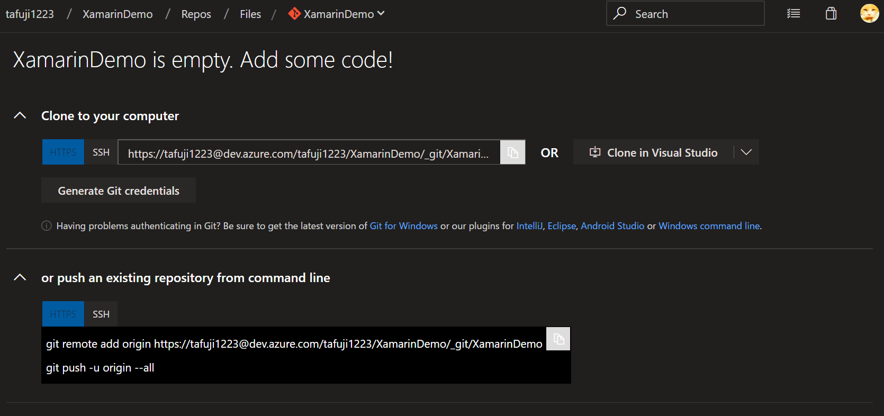

# Lab 1: Azure DevOps Pipeline で Xamarin アプリケーションをビルドする

## ここで学習すること

ここでは、以下のことを学習します。

- Azure DevOps の Pipeline を利用して、Xamarin アプリケーションのビルドを行う

## 目次

- Azure DevOps でチームプロジェクトを作成する
- プロジェクトの作成
- コードをプッシュする
- Azure Pipeline の作成

## 1. Azure DevOps でチームプロジェクトを作成する

1. Azure DevOps のサイトにアクセスします

2. Azure DevOps のサイトで、[Create Project] をクリックします

    

3. プロジェクト名などを入力します

    

    |項目名|説明|例|
    |----|----|----|
    |Project name|チームプロジェクトの名前を入力します|XamarinDemo|
    |Description|チームプロジェクトの説明を入力します|de:code ハンズオンサンプル|
    |Visibility|チームプロジェクトを外部に公開するかどうかを指定します|Private を選択します|
    |Version control|チームプロジェクトで利用する |Git を選択します|
    |Work item process|プロセステンプレートを選択します|Agile を選択します|

4. しばらく待つと、チームプロジェクトが作成されます

    

## 2. リポジトリにソースコードを Push する

1. リポジトリをクローンします
   1. 「Clone in Visual Studio」をクリックします

        

   2. リポジトリをクローンするディレクトリを選択します

2. Xamarin アプリケーションを作成します

## 3. Azure Pipeline の作成

## 4. ビルド実行
