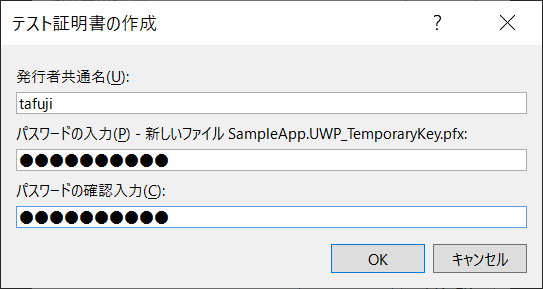
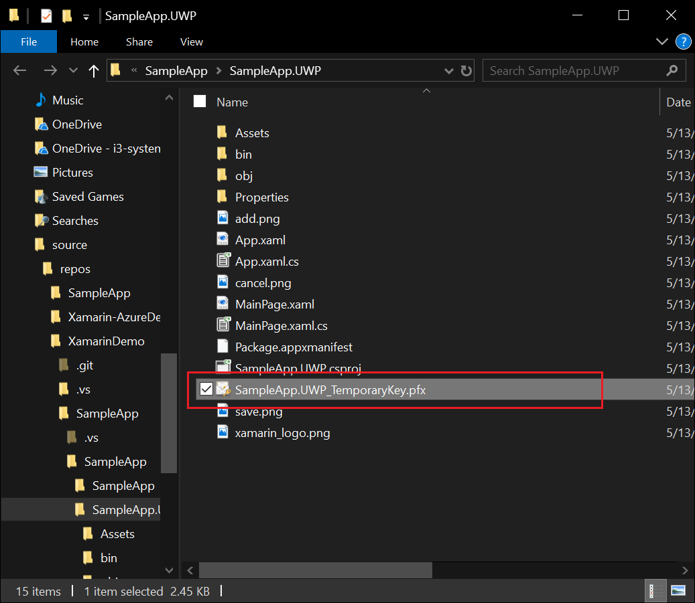
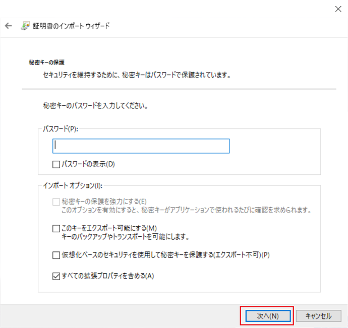
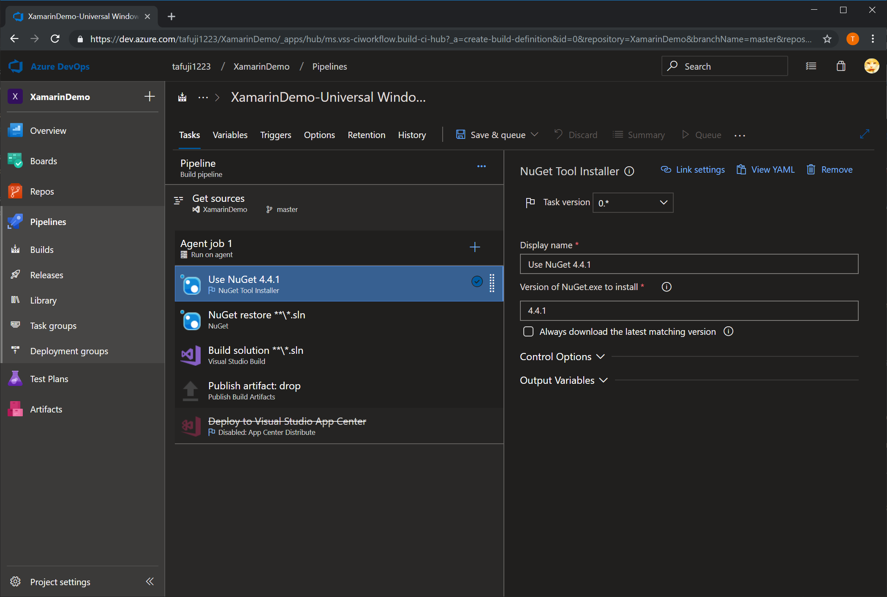

# Lab 1: Azure DevOps Pipeline による Xamarin アプリのビルド

## 0. Lab 1 で習得できること

このハンズオンでは、以下のことを学ぶことができます。

1. Azure DevOps でチームプロジェクトを作成する方法
2. Azure Repos からコードをクローンする方法
3. Azure Repos にコードをプッシュする方法
4. Azure Pipelines で Pipeline を作成する方法
5. Azure Pipelines でアプリをビルドする方法

## 1. Azure DevOps でチームプロジェクトを作成する

### 1.1 Azure DevOps のサイトにアクセスします

以下のサイトで、Azure DevOps にサインインしてください。

- [Azure DevOps](https://dev.azure.com)

"Sign in to Azure DevOps" をクリックすると、Azure DevOps のサインインページに移動します。

### 1.2 Azure DevOps のサイトで、[Create Project] をクリックします

### 1.3 プロジェクト名などを入力します

|項目名|説明|例|
|----|----|----|
|Project name|チームプロジェクトの名前を入力します|XamarinDemo|
|Description|チームプロジェクトの説明を入力します|de:code ハンズオンサンプル|
|Visibility|チームプロジェクトを外部に公開するかどうかを指定します|Private を選択します|
|Version control|チームプロジェクトで利用する |Git を選択します|
|Work item process|プロセステンプレートを選択します|Agile を選択します|

### 1.4 しばらく待つと、チームプロジェクトが作成されます

## 2. Azure Repos からコードをクローンする

### 2.1 リポジトリのページに移動します

### 2.2 "add a .gitigonore:None" をクリックして、"Visual Studio" を選択し、"Initialize" ボタンを押します

### 2.3 リポジトリが初期化されたことを確認してください

### 2.4 "Clone" をクリックします

### 2.5 IDE の下にある "Clone in VS Code" の右側にあるボタンを押し、"Visual Studio" を選択します

### 2.6 Visual Studio を開きます

### 2.7 リポジトリをクローンするディレクトリを選択し、「複製」ボタンをクリックします

## 3. Azure Repos にコードをプッシュする

### 3.1 ソリューションを新規作成します

### 3.2 プロジェクトのフィルタリングを行います

### 3.3 Xamarin.Forms プロジェクトを選択します

### 3.4 プロジェクトの詳細を入力します

### 3.5 プロジェクトのテンプレートを選択します

|項目名|説明|
|----|----|
|テンプレートの選択|"マスター詳細" を選択します|
|プラットフォーム|"UWP" にチェックを入れる|
|モバイルバックエンド|チェックしない|

### 3.6 アプリケーションの動作確認を行います

#### 3.6.1 スタートアッププロジェクトの設定

#### 3.6.2 プロジェクトのデバッグ

#### 3.6.3 動作確認

### 3.6.7 テスト用証明書の作成とインポート

1. パッケージマニフェスト（Package.appmanifest）ファイルを開いて、"パッケージ化" タブを選択し、"証明書の選択" ボタンを押します

2. 証明書の選択で、"テスト証明書" を選択します

4. "OK" ボタンを押します

5. テスト証明書をソース管理に追加します。作成された pfx ファイルを右クリックし、"無視されたファイルをソース管理に追加" を選択します

6. テスト証明書をローカルマシンにインストールします。作成したテスト証明書をエクスプローラー上でダブルクリックします

7. ローカルマシンの信頼されたルート証明機関に証明書をインポートします

### 3.6.8 コードをリポジトリへ Push する

1. チームエクスプローラー上で、"変更" を選択します

2. ソースコードなどすべての成果物が、"ステージング済みの変更" に移動していることを確認し、"コメント" を入力して、"ステージング済みをコミット" ボタンを押します

3. ローカルでのコミットが完了したら、"同期" のリンクをクリックします

4. 同期画面が表示されるので、"同期" のリンクをクリックします

5. Azure DevOps 上にコードが Push されます

## 4. Azure Pipelines でビルド定義を作成する

### 4.1 Azure DevOps の Pipelines のページにアクセスします

### 4.2 New Pipeline をクリックします

### 4.3 "Use Classic Editor" をクリック

### 4.4 リポジトリを選択して、"Continue" ボタンをクリックします

|項目名|説明|値|
|----|----|----|
|Select a source|ソースコードのリポジトリの種類を選択します|ここでは、"Azure Repos Git" を選択します|
|Team project|pipeline を作成するチームプロジェクトを選択します|作成したチームプロジェクトを選択します（ハンズオンの例では、"XamarinDemo" を選択します）|
|Repository|ソースコードのリポジトリ名を選択します|ハンズオンの例では、"XamarinDemo" を選択します|
|Default branch for manual and scheduled builds|Pipeline でビルドを行う既定のブランチを選択します|master|

### 4.5 ビルド定義のテンプレートで、"Universal Windows Platform" を選択し、"Apply" ボタンを押します

### 4.6 ビルド定義が作成されることを確認し、ビルド定義を保存します

ビルド定義が作成されたことを確認して、"Save & Queue" のタブをクリックして、"Save" をクリックします。

### 4.7 ビルド定義の保存

コメントを入力し、"Save" ボタンを押します。

## 5. Azure Pipelines でアプリをビルドする

### 5.1 ビルドパイプラインで "Queue" ボタンをクリックします

### 5.2 設定値はそのままで、"Queue" ボタンをクリックします

### 5.3 ビルドが開始されたことを確認します

ビルドが開始されると、ビルド番号のリンクが表示されます。そのリンクをクリックします。

リンクをクリックすると、ビルド中のタスク状況が表示されます。

### 5.4 Azure Pipeline 上でビルドが成功することを確認してください

以上で、ハンズオンの Lab 1 は終了です。
